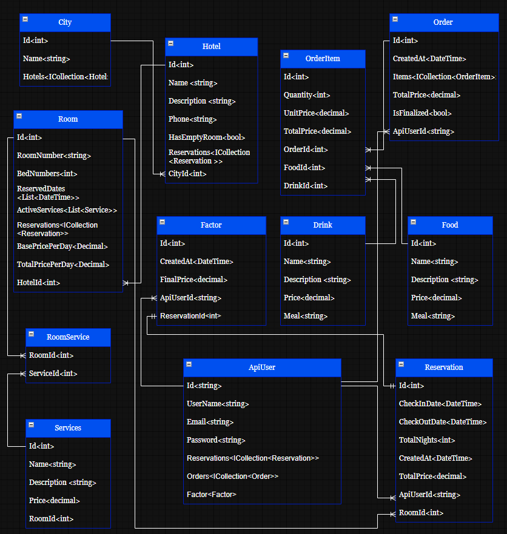

# HotelManagementSystem

A hotel management REST API built with ASP.NET Core and PostgreSQL. The system handles hotel management, room reservations, food and drink orders, services, and invoice/factor generation.

## Tech Stack

- **ASP.NET Core Web API**
- **Entity Framework Core**
- **PostgreSQL**
- **ASP.NET Core Identity**
- **JWT Authentication**
- **AutoMapper**
- **Serilog**
- **Swagger / OpenAPI**
- **Docker & Docker Compose**

## Features

- User registration and authentication
- JWT-based authorization
- Role-based access control
- Hotel and city management
- Room management
- Room reservations
- Food and drink management
- Service management
- Order and order-item management
- Automatic factor/invoice generation
- Automatic customer role management
- Centralized exception handling
- Structured application logging

## Architecture

The application follows a layered architecture separating API controllers, business logic, data access, and domain models.

```text
Client
  │
  ▼
ASP.NET Core Web API
  │
  ├── Controllers
  │
  ├── Services
  │
  ├── Repositories
  │
  ├── Entity Framework Core
  │
  └── ASP.NET Core Identity
          │
          ▼
      PostgreSQL
```

### Main Components

- **Controllers** — Expose REST API endpoints.
- **Services** — Handle background processing and application-level operations.
- **Repositories** — Encapsulate database access.
- **Entity Framework Core** — ORM and database interaction.
- **ASP.NET Core Identity** — User and role management.
- **JWT** — Stateless API authentication.
- **PostgreSQL** — Persistent relational database.
- **Serilog** — Structured application logging.

## Database Schema

The database contains entities for hotels, rooms, reservations, users, orders, services, and billing.



The schema is managed using Entity Framework Core migrations.

## Docker

The application can be run as a multi-container application using Docker Compose.

```text
                    Docker Compose
                         │
              ┌──────────┴──────────┐
              │                     │
              ▼                     ▼
       ┌─────────────┐       ┌──────────────┐
       │  hotel-api  │──────▶│ hotel-postgres│
       │ ASP.NET Core│       │ PostgreSQL 18 │
       │    :8080    │       │    :5432      │
       └─────────────┘       └──────────────┘
```

### Requirements

- Docker
- Docker Compose

### Configuration

Create the environment file from the provided example:

```bash
cp .env.example .env
```

Set the required PostgreSQL credentials in `.env`.

> `.env` is ignored by Git and should not be committed.

### Start the Application

Build and start all containers:

```bash
docker compose up --build -d
```

Check the container status:

```bash
docker compose ps
```

The PostgreSQL container should report `healthy` and the API should be `Up`.

### Access the API

API:

```text
http://localhost:8080
```

Swagger / OpenAPI:

```text
http://localhost:8080/swagger
```

### View Logs

API logs:

```bash
docker compose logs api
```

PostgreSQL logs:

```bash
docker compose logs postgres
```

### Stop the Application

```bash
docker compose down
```

PostgreSQL data and ASP.NET Core Data Protection keys are stored in Docker named volumes and persist when containers are recreated.

## Database Migrations

Entity Framework Core migrations are applied automatically when the API starts.

The database schema is therefore created automatically when running the application with Docker.

Migration history is stored in:

```text
__EFMigrationsHistory
```

## API Authentication

The API uses **ASP.NET Core Identity** for user and role management and **JWT Bearer tokens** for authentication.

Authorization policies are defined for:

- `User`
- `Customer`
- `Administrator`

Protected endpoints require a valid JWT access token.

Swagger includes Bearer authentication support for testing protected endpoints.

## Project Structure

```text
HotelManagementSystem/
│
├── api/
│   ├── Configuration/
│   ├── Controllers/
│   ├── Data/
│   ├── Exeptions/
│   ├── Interfaces/
│   ├── Middleware/
│   ├── Migrations/
│   ├── Models/
│   ├── Repositories/
│   ├── Services/
│   ├── Program.cs
│   └── api.csproj
│
├── docs/
│   └── database-schema.png
│
├── Dockerfile
├── docker-compose.yml
├── .env.example
├── .gitignore
└── README.md
```

## Running Without Docker

If you want to run the API directly with the .NET SDK:

```bash
cd api
dotnet restore
dotnet run
```

Make sure PostgreSQL is available and the `DefaultConnection` connection string is configured correctly.

## License

This project is intended for educational and portfolio purposes.
